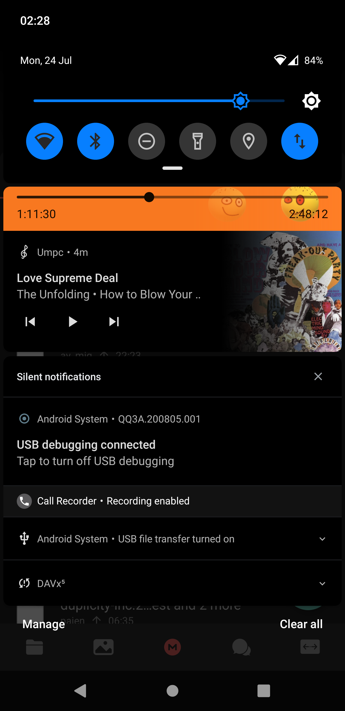
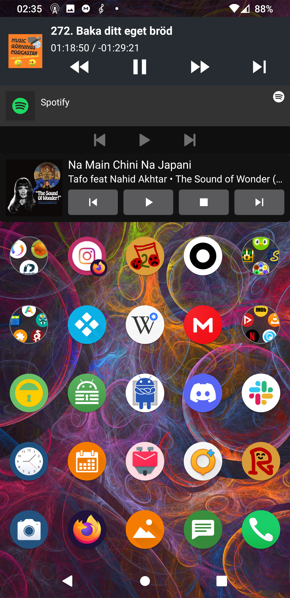

# Umpc

An Android client for [MPD](https://mpd.readthedocs.io/en/latest/index.html).

Umpc is not an acronym. It is pronounced "oomps".

| Cover screen | The queue | Library |
| :---: | :---: | :---: |
|  |  |  |
| Album view | Notification | Widget |
|  |  |  |
| Dynamic playlists 1 | Dynamic playlists 2 | Settings |
|  |  |  |
